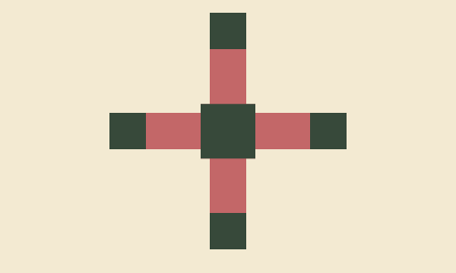
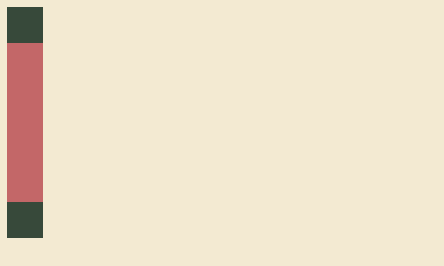
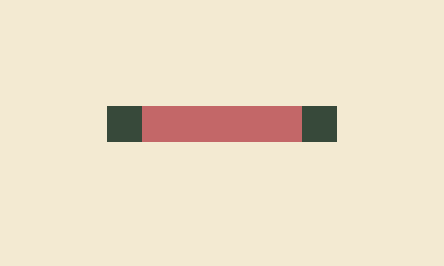
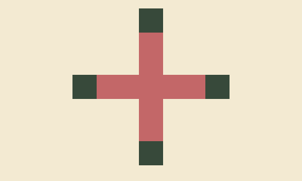
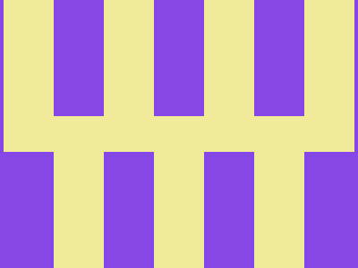
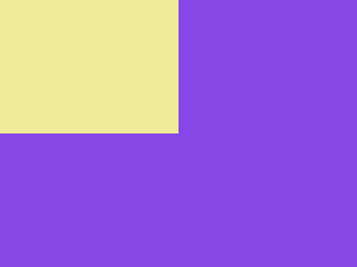
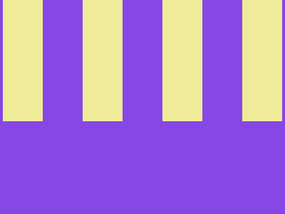
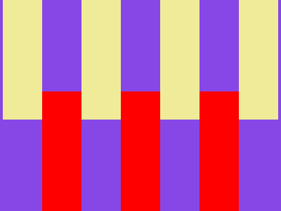

I started doing [CSSBattle](https://cssbattle.dev/) challenges recently. I am not a CSS expert, but that is exactly what makes these challenges interesting for me: I can learn something new while feeling entertained.

In this post, I am going to go through several top CSS Battle solutions and see how they work.

## 06 January 2026



The top solution is by the user [Vegy](https://cssbattle.dev/player/cubachatou). It looks like this:
```html wrap=true
<dt><p><style>*{background:#F3EAD2;*{offset:ray(0deg);width:40;height:10lh;background:#C36768;border-block:5ch solid#243D}p{width:60;font:13q/0'
```

### `border-block`

```html
<dt>
<style>
    html {
        background:#F3EAD2;
    }
    dt {
        width:40;
        height:10lh;
        background:#C36768;
        border-block:5ch solid #243D
    }
```

I think `background`, `width`, and `height` are obvious here. (`10lh` just means 10 line heights.)

[`border-block`](https://developer.mozilla.org/en-US/docs/Web/CSS/Reference/Properties/border-block) is a way to specify borders, just like `border-left` or `border-bottom`, but it specifies borders between blocks. By default, this means it sets values for `border-top` and `border-bottom` simultaneously.

The color `#243D` is different from the color in the target image, which is `#38483C`. It has opacity, and when combined with the background color it produces the required color. This is a neat trick that saves two characters.

`5ch` means 5 [widths of the glyph `0`](https://developer.mozilla.org/en-US/docs/Web/CSS/Reference/Values/length#ch).

This code produces the following image:


### `offset: ray(0deg)`

Let's add one more line (`offset: ray(0deg)`) from the original solution:
```html ins={7}
<dt>
<style>
    html {
        background:#F3EAD2;
    }
    dt {
        offset: ray(0deg);
        width:40;
        height:10lh;
        background:#C36768;
        border-block:5ch solid #243D
    }
```

Normally, the [`offset`](https://developer.mozilla.org/en-US/docs/Web/CSS/Reference/Properties/offset) property is used with animations and is a shorthand for setting different `offset-*` properties in one go.

When only one value is specified, it sets the `offset-path` property, which defines the path the element will move along when animated. `ray(0deg)` uses the [`ray`](https://developer.mozilla.org/en-US/docs/Web/CSS/Reference/Values/ray) function to specify that it should move straight up. It turns out that to move up, the element has to be rotated 90 degrees counterclockwise.

The value for the `offset-position` property is not specified, so it is set to `normal`, which means that the element is placed in the center of its parent element.

There is no animation specified, so the element is positioned as it would be in the first frame of an animation.

The HTML above is rendered like this:


### Making a cross

Let's apply the style for the `dt` element to the `body` as well:

```html {6}
<dt>
<style>
    html {
        background:#F3EAD2;
    }
    body, dt {
        offset: ray(0deg);
        width:40;
        height:10lh;
        background:#C36768;
        border-block:5ch solid #243D
    }
```

Yes, `body` is a normal element that behaves just like any other element. What we get now is that `body` and `dt` look exactly the same: a vertical rectangle with squares of a different color at the ends. `body` is centered inside the `html` element and rotated to make it horizontal. `dt` is centered inside the body and rotated again, so it appears vertical.

It looks like this:


### Adding the central part

In the target image, there is a square in the center. Let's add a `p` element and style it to produce that central element.

```html ins={2,14-20}
<dt>
<p>
<style>
    html {
        background:#F3EAD2;
    }
    body, dt {
        offset: ray(0deg);
        width:40;
        height:10lh;
        background:#C36768;
        border-block:5ch solid #243D
    }
    p {
        offset: ray(0deg);
        width:60;
        height:0;
        background:#C36768;
        border-block:30px solid #243D
    }
```

This new `p` element is very similar to the `body` and `dt` elements. We have only changed its dimensions so the central part disappears and the squares at the ends together appear as one square of size 60×60.

This renders an image that is similar to the target image:


### Finishing touches

We can reuse the `body, dt` style for the `p` element, as it is very similar. We can take advantage of `height:10lh` (meaning 10 line heights) and `border-block:5ch` (meaning a border width equal to the width of 5 `0` characters), and change the `font` property for the `p` element.

```html
<dt>
<p>
<style>
    html {
        background:#F3EAD2;
    }
    body, dt {
        offset: ray(0deg);
        width:40;
        height:10lh;
        background:#C36768;
        border-block:5ch solid #243D
    }
    p {
        width:60;
        font:13q/0 ''
    }
```

With `font:13q/0 ''`, we set the `font-size` property to `13q` (1Q = 1/40th of 1 cm), the `line-height` to `0`, and the `font-family` to an empty string. `height:10lh` in combination with `line-height:0` effectively sets `height` to `0`. As for the `font-size`, it affects the `border-width` value because it is specified as `5ch`.

The last trick is to use the `*` selector and nesting to make the CSS even shorter.

```html
<dt>
<p>
<style>
    * {
        background: #f3ead2;
        * {
            offset: ray(0deg);
            width: 40;
            height: 10lh;
            background: #c36768;
            border-block: 5ch solid #243d;
            p {
                width: 60;
                font: 13Q/0 "";
            }
        }
    }
```

After removing the whitespace, this code is equivalent to the top solution.

## 05 January 2026



I do not have access to the top solutions for this day, but I saved one. Unfortunately, I do not know who the author is.

```html wrap=true
<StYle>*{background:conic-gradient(var(--b,#8647E6)75%,#EFEB99 0)4px 0/7em 85vw;*{margin:130 56 0;--b:#0000
```

This code does not introduce any new elements and only uses `html` and `body`, which are already present in the document.

### Conic gradient

Let's look at what the `background` property does here:
```css
html {
    background: conic-gradient(#8647e6 75%, #efeb99 0);
}
```

This code sets the background image to a conic gradient with two colors and a hard edge between them: one color covers the range from 0 to 75% of the full circle (or 270 degrees), and the other covers the range from 75% back to 0.

The resulting image looks like this:


### Repeating the background

The [`background`](https://developer.mozilla.org/en-US/docs/Web/CSS/Reference/Properties/background) property allows you to specify not only the background image (the conic gradient in our case), but also values for `background-position` and `background-size`.

```css
html {
    background: conic-gradient(#8647e6 75%, #efeb99 0) 4px 0/7em 85vw;
}
```

Here we set `background-position` to `4px 0` and `background-size` to `7em 85vw`.

When the background image is smaller than the element, it is tiled by default, and the result is this:



### Applying the same background to `body` and positioning it

To achieve the final image, we can use the `body` element.

Let's first position it and make it visible:
```css
html {
    background: conic-gradient(#8647e6 75%, #efeb99 0) 4px 0/7em 85vw;
}
body {
    background: red;
    margin: 130 56 0;
}
```

This will look like this:


We can create the needed background using exactly the same trick as for the `html` element—just use a fully transparent color instead of the color that covers 75% of the background image. This will create stripes that make the image look exactly as needed. In the code below, I made the stripes red instead of yellow to make it easier to understand what is going on:

```css
html {
    background: conic-gradient(#8647e6 75%, #efeb99 0) 4px 0/7em 85vw;
}
body {
    background: conic-gradient(#0000 75%, red 0) 4px 0/7em 85vw;
    margin: 130 56 0;
}
```



### Code reuse

Instead of specifying the gradient twice, we can use CSS variables to change the color. The `var()` function takes the variable name as the first parameter, and it also has an optional second parameter that provides a fallback value in case the variable is not defined.

```css
html,
body {
    background: conic-gradient(var(--b, #8647e6) 75%, #efeb99 0) 4px 0/7em 85vw;
}
body {
    --b: #0000;
    margin: 130 56 0;
}
```

Finally, there is no need to use tag names, as we can use `*` and nesting:
```css
* {
    background: conic-gradient(var(--b, #8647e6) 75%, #efeb99 0) 4px 0/7em 85vw;
    * {
        --b: #0000;
        margin: 130 56 0;
    }
}
```

This code produces the desired image and, after removing the whitespace, is equivalent to the top solution.


## Final words

It took more time than I expected to write this up. It was definitely interesting for me, and I would like to do something like this again. I hope you also enjoyed reading this blog post.

## Discussion

Join the discussion on [Reddit](https://www.reddit.com/r/css/comments/1q6n6i2/decomposing_top_css_battle_solutions).
