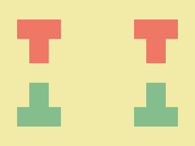
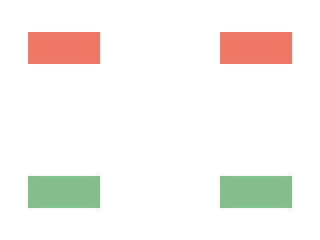

This is the continuation of the blog post: [Top CSS Battle solutions](2026-01-07-css-battle).
I deconstruct top CSS Battle solutions to see how they work and teach myself. 

## 08 January 2026



Top solution is by [H_Bliertz](https://cssbattle.dev/player/h_blierzt). The code is as follows:
```html wrap=true
<style>*{*{background:#DC26;--b:38%5ch/11q}margin:40 35;border-image:linear-gradient(#E76,50%,#84BE8D 0)50%/var(--b,5ch 5lh
```

This code only uses the `html` and `body` elements and can be rewritten as this for better understanding:
```css
  * {
    * {
      background: #dc26;
      --b: 38%5ch/11Q;
    }
    margin: 40 35;
    border-image: linear-gradient(#e76, 50%, #84be8d 0) 50% / var(--b, 5ch 5lh);
  }
```

It uses nesting and `var()` with default parameter to avoid duplication. We can rewrite it like:
```css
  html {
    margin: 40 35;
    border-image: linear-gradient(#e76, 50%, #84be8d 0) 50% / 5ch 5lh;
  }
  body {
    margin: 40 35;
    background: #dc26;
    border-image: linear-gradient(#e76, 50%, #84be8d 0) 50% / 38%5ch/11Q;
  }
```

The main thing here is usage of `linear-gradient` as the value for the `border-image`.

Linear gradient itself looks like this:
```css
  html {
    background: linear-gradient(#e76, 50%, #84be8d 0);
  }
```


Let's rewrite `border-image` properties without shorthands to see what is going on:
```css
html {
    margin: 40 35;
    border-image-source: linear-gradient(#e76, 50%, #84be8d 0);
    border-image-width: 5ch 5lh;
    border-image-slice: 50%;
    border-image-outset: 0; /* default value */
    border-image-repeat: stretch; /* default value */
}
body {
    margin: 40 35;
    background: #dc26;
    border-image-source: linear-gradient(#e76, 50%, #84be8d 0);
    border-image-width: 38% 5ch;
    border-image-slice: 50%;
    border-image-outset: 11Q;
    border-image-repeat: stretch; /* default value */
}
```

For `html` alone this renders the following image:


`border-image` property sets the image to be drawn on the border. 

[`border-image-width`](https://developer.mozilla.org/en-US/docs/Web/CSS/Reference/Properties/border-image-width) is just the same as `border-width` but used together with `border-image`.

[`border-image-slice`](https://developer.mozilla.org/en-US/docs/Web/CSS/Reference/Properties/border-image-slice) is about how the image is sliced into nine parts:
```
border-image-slice: top left right bottom

       |<-- left  -->|        |<-- right  -->|
   \/--+-------------+--------+--------------+
   top |   Top-left  |   Top  |   Top-right  | 
   /\--+-------------+--------+--------------+
       |     Left    | Center |    Right     |
   \/--+-------------+--------+--------------+
bottom | Bottom-left | Bottom | Bottom-right |
   /\--+-------------+--------+--------------+
```
In our example all four values (`left`, `right`, `top` and `bottom`) for the `border-image-slice` are set to `50%`. This means that the center collapses and the corners take the whole image. In this case only the corners are drawn. This behaviour is defined in the [specification](https://www.w3.org/TR/css-backgrounds-3) like this:
> The regions given by the border-image-slice values may overlap. However if the sum of the right and left widths is equal to or greater than the width of the image, the images for the top and bottom edge and the middle part are empty—​which has the same effect as if a nonempty transparent image had been specified for those parts. Analogously for the top and bottom values.

For the `body` element additionally we specify the [`border-image-outset`](https://developer.mozilla.org/en-US/docs/Web/CSS/Reference/Properties/border-image-outset) which controls the distance of the border image from the element. Basically it works just the same as increasing the size of the element itself.

All together this renders as the desired image.

## 07 January 2026


The top solution is by [Vegy](https://cssbattle.dev/player/cubachatou).

It reads like this:
```html wrap=true
<style>*{background:#2F434E;color:CF6939;box-shadow:5vh 90q,65px 122q,122q 153q;width:110;height:70;*{margin:0 160
```

It is equavalent to this css:
```css
html,
body {
    background: #2f434e;
    color: CF6939;
    box-shadow: 5vh 90Q, 65px 122Q, 122Q 153Q;
    width: 110;
    height: 70;
    /* border: 1px solid red; */
}
body {
    margin: 0 160;
}
```

It uses two already existing elements `html` and `body`. 

First thing is that `html` element, while being a normal element, has something special to it: it's background color spans for the whole document unlike any other element. 

Elements itself are not visible, but there are three `box-shadow`'s that are visible and form the needed shape. If `box-shadow` does not specify a color the `color` property of the element itself is used.

I added a red border to the elements, so that we can see where they are themselves:

