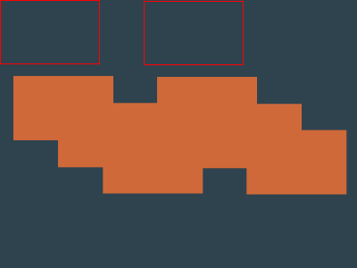

todo: foreword

## 07 January 2026


The top solution is by [Vegy](https://cssbattle.dev/player/cubachatou) again.

It reads like this:
```html wrap=true
<style>*{background:#2F434E;color:CF6939;box-shadow:5vh 90q,65px 122q,122q 153q;width:110;height:70;*{margin:0 160
```

It is equavalent to this css:
```css
html,
body {
    background: #2f434e;
    color: CF6939;
    box-shadow: 5vh 90Q, 65px 122Q, 122Q 153Q;
    width: 110;
    height: 70;
    /* border: 1px solid red; */
}
body {
    margin: 0 160;
}
```

It uses two already existing elements `html` and `body`. 

First thing is that `html` element, while being a normal element, has something special to it: it's background color spans for the whole document unlike any other element. 

Elements itself are not visible, but there are three `box-shadow`'s that are visible and form the needed shape. If `box-shadow` does not specify a color the `color` property of the element itself is used.

I added a red border to the elements, so that we can see where they are themselves:

